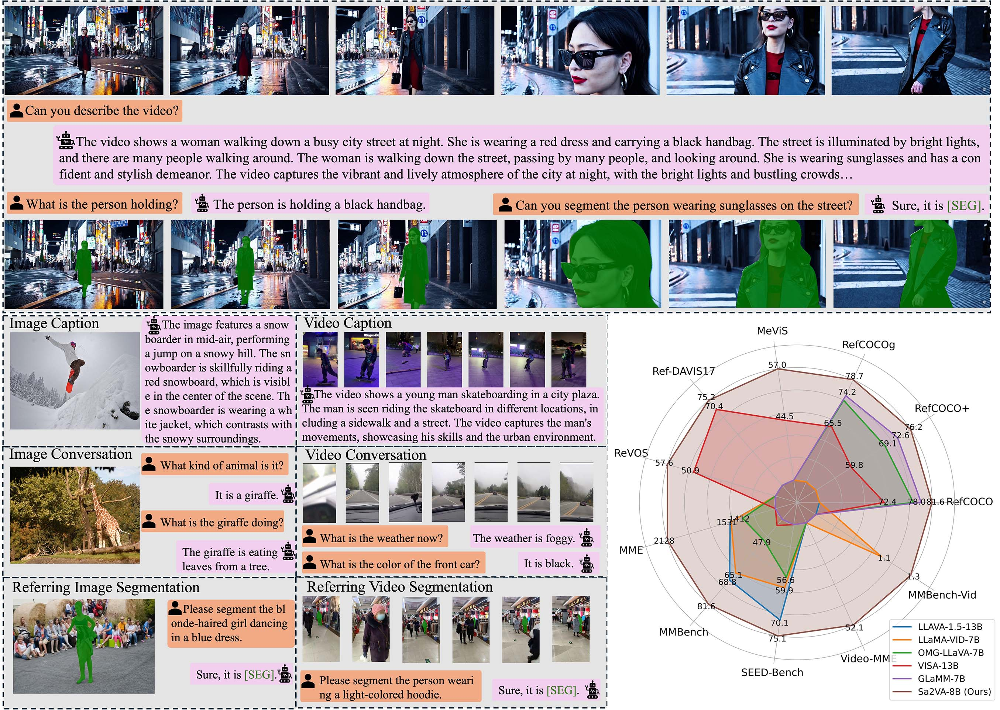

# Sa2VA: Marrying SAM2 with LLaVA for Dense Grounded Understanding of Images and Videos

[\[🏠 Sa2VA\]](https://lxtgh.github.io/project/sa2va)  [\[📜 arXiv\]](https://arxiv.org/abs/2501.04001) [\[🤗 HuggingFace\]](https://huggingface.co/collections/ByteDance/sa2va-model-zoo-677e3084d71b5f108d00e093) [\[🎥 Introduction\]]() [\[🧑‍💻 GitHub\]](https://github.com/magic-research/Sa2VA) [\[Gradio Demo (Ours internal: Sa2VA-4B)\]](https://5512470799b6b35fbc.gradio.live/) [\[Gradio Demo (By HuggingFace Offical)\]](https://huggingface.co/spaces/fffiloni/Sa2VA-simple-demo) [\[🤖 Replicate Demo\]](https://replicate.com/bytedance)


[**Haobo Yuan**](https://yuanhaobo.me/)<sup>1*</sup> · [**Xiangtai Li**](https://lxtgh.github.io/)<sup>2*&dagger;</sup> · [**Tao Zhang**](https://zhang-tao-whu.github.io/)<sup>2,3*</sup> · [**Zilong Huang**](http://speedinghzl.github.io/)<sup>2</sup> · [**Shilin Xu**](https://xushilin1.github.io/)<sup>4</sup> ·[**Shunping Ji**](https://scholar.google.com/citations?user=FjoRmF4AAAAJ&hl=en)<sup>3</sup> ·[**Yunhai Tong**](https://scholar.google.com/citations?user=T4gqdPkAAAAJ&hl=zh-CN)<sup>4</sup> ·

[**Lu Qi**](https://luqi.info/)<sup>2</sup> · [**Jiashi Feng**](https://scholar.google.com/citations?user=Q8iay0gAAAAJ&hl=en)<sup>2</sup> · [**Ming-Hsuan Yang**](https://faculty.ucmerced.edu/mhyang/)<sup>1</sup>

<sup>1</sup>UC Merced&emsp;&emsp;&emsp;&emsp;<sup>2</sup>ByteDance Seed&emsp;&emsp;&emsp;&emsp;<sup>3</sup>WHU&emsp;&emsp;&emsp;&emsp;<sup>4</sup>PKU

&dagger; project lead&emsp;* The first three authors equally contribute to the work.




## News

- [x] Pixel-SAIL and Qwen-VL like models will be related before the end of July!!

- [x] Check out our recent works on pixel-LLM using one transformer, Pixel-SAIL[arxiv](https://arxiv.org/abs/2504.10465).

- [x] Sa2VA serves as the first and third solutions for 4th PVUW Workshop@CVPR 2025! [the first solution report](https://arxiv.org/pdf/2504.05178), [the third solution report](https://arxiv.org/abs/2504.00476).
      
- [x] We plan to release the Qwen-VL-based Sa2VA model for the next version! Please stay tuned!


## Opensource progress

- [ ] Release Pixel-SAIL models and code. (To be done)
- [ ] Release Qwen-VL related models. (To be done)
- [x] Release Open-sourced training datasets.
- [x] Release Ref-SAM-v dataset.
- [x] Release evaluation code for each dataset. 
- [x] Release 1B,4B,8B, 26B model.
- [x] Release training code for 1b, 4b, 8b model.
- [x] Release inference and test code.
- [x] Release demo code. 


## Overview

This repository contains the code for the paper "Sa2VA: Marrying SAM2 with LLaVA for Dense Grounded Understanding of Images and Videos".

Sa2VA is the first unified model for the dense grounded understanding of both images and videos. Unlike existing multi-modal large language models, which are often limited to specific modalities and tasks, Sa2VA supports a wide range of image and video tasks, including referring segmentation and conversation, with minimal one-shot instruction tuning. Sa2VA combines SAM-2, a foundation video segmentation model, with LLaVA, an advanced vision-language model, and unifies text, image, and video into a shared LLM token space.


## Model Zoo

We provide the following models:
| Model Name |                             Base MLLM                             |                                 Language Part                                 |                       HF Link                        |
|:----------:|:-----------------------------------------------------------------:|:-----------------------------------------------------------------------------:|:----------------------------------------------------:|
|  Sa2VA-1B  | [InternVL2.0-1B](https://huggingface.co/OpenGVLab/InternVL2-1B) |   [Qwen2-0.5B-Instruct](https://huggingface.co/Qwen/Qwen2-0.5B-Instruct)    | [🤗 link](https://huggingface.co/ByteDance/Sa2VA-1B) |
|  Sa2VA-4B  | [InternVL2.5-4B](https://huggingface.co/OpenGVLab/InternVL2_5-4B) |    [Qwen2.5-3B-Instruct](https://huggingface.co/Qwen/Qwen2.5-3B-Instruct)     | [🤗 link](https://huggingface.co/ByteDance/Sa2VA-4B) |
|  Sa2VA-8B  | [InternVL2.5-8B](https://huggingface.co/OpenGVLab/InternVL2_5-8B) |  [internlm2_5-7b-chat](https://huggingface.co/internlm/internlm2_5-7b-chat)   | [🤗 link](https://huggingface.co/ByteDance/Sa2VA-8B) |
|  Sa2VA-26B | [InternVL2.5-26B](https://huggingface.co/OpenGVLab/InternVL2_5-26B) |  [internlm2_5-20b-chat](https://huggingface.co/internlm/internlm2_5-20b-chat)   | [🤗 link](https://huggingface.co/ByteDance/Sa2VA-26B) |

## 🤗 Gradio Demos

We provide a script that implements interactive chat using gradio, which requires installing `gradio==4.42.0`. You can try it to build a local chat interface quickly.
```shell
PYTHONPATH=. python projects/llava_sam2/gradio/app.py ByteDance/Sa2VA-4B
```

## 🚀 Quick Start

Our Sa2VA model is available on 🤗HuggingFace. With very few steps, you can try it with your own data. You can install the `demo/requirements.txt` to avoid training-only packages.


**Option1 - scripts:**

Supposing you have a folder (`PATH_TO_FOLDER`) that contains images of a video, you can use the following script to chat with the Sa2VA model or segment the objects in the videos.

```bash
> cd scripts
> python demo/demo.py PATH_TO_FOLDER --model_path ByteDance/Sa2VA-8B --work-dir OUTPUT_DIR --text "<image>Please describe the video content."
```

If the output contains the segmentation results, the results will be saved to `OUTPUT_DIR`.

**Option2 - Jupter Notebook:**

Please refer to `demo.ipynb`.

## 🎥 Demo

<details open>
<summary>Demo 1</summary>
Input Video (Source: La La Land 2016):


Instruction: "Please segment the girl wearing the yellow dress."
</details>

<details open>
<summary>Demo 2</summary>
Input Video (Source: La La Land 2016):


Instruction: "Please segment the main character."
</details>


<details open>
<summary>Demo 3</summary>
Input Video (Source: Internet):


Instruction: "Please segment the person wearing sun glasses."
</details>


<details open>
<summary>Demo 4</summary>
Input Video (Source: Internet):


Instruction: "Instruction: "Please segment the singing girl."
</details>

<details open>
<summary>Demo 5</summary>
Input Video:


Instruction: "What is the atmosphere of the scene?"

Answer: "The scene has a dark and mysterious atmosphere, with the men dressed in suits and ties, and the dimly lit room."
</details>


## Training
<details open>
<summary>Installation</summary>

1. Please install the python and pytorch first:
```bash
> conda create -n vlm python=3.10
> conda activate vlm
> conda install pytorch==2.3.1 torchvision==0.18.1 pytorch-cuda=12.1 cuda -c pytorch  -c "nvidia/label/cuda-12.1.0" -c "nvidia/label/cuda-12.1.1"
```

2. Install mmcv, we use 2.1.0 as default version:
```bash
> pip install mmcv==2.1.0 -f https://download.openmmlab.com/mmcv/dist/cu121/torch2.3/index.html
```

3. Install other dependencies:
```bash
> pip install -r requirements.txt
```
</details>

Please make sure using the correct versions of transformers and peft.

<
<summary>Pretrained Model Preparation</summary>

You are expected to download the following pretrained models and place them in the `./pretrained` directory:
- [sam2_hiera_large.pt](https://huggingface.co/facebook/sam2-hiera-large)
- [InternVL2_5-4B](https://huggingface.co/OpenGVLab/InternVL2_5-4B)

You can download the remaining models from InternVL2.5 [huggingface collections](https://huggingface.co/collections/OpenGVLab/internvl25-673e1019b66e2218f68d7c1c). 

```
./ # project root
pretrained/
├── sam2_hiera_large.pt
├── InternVL2_5-1B
├── InternVL2_5-4B
```


<details open>
<summary>Data Preparation</summary>

Please download the training datasets and place them in the `data` directory. The download link is [here](https://huggingface.co/datasets/Dense-World/Sa2VA-Training).

Please directly put the zip files into the `data` directory and unzip them. For example, you can download the `video_datas_mevis.zip` and unzip it in the `data` directory like:
```bash
> unzip video_datas_mevis.zip
```

The final data structure should be like:
```
data/
├── video_datas
|   ├── revos
|   ├── mevis
|   └── davis17
|   └── chat_univi # video-chat data
|   └── sam_v_full # please download this from sam-2 offical repp.
|   └── sam_v_final_v3.json
├── ref_seg
|   ├── refclef
|   ├── refcoco
|   ├── refcoco+
|   ├── refcocog
|   ├── 
├── glamm_data
|   ├── images
|   ├── annotations
├── osprey-724k
|   ├── Osprey-724K
|   ├── coco
├── llava_data
|   ├── llava_images
|   ├── LLaVA-Instruct-150K
|   ├── LLaVA-Pretrain

```
`sam_v_full` is the SA-V dataset, which is not included in the download link. You can download it from [here](https://ai.meta.com/datasets/segment-anything-video/).
</details>

<details open>
<summary>Training Script</summary>

Please run the following script to train using 8 GPUS, we suggest using at least 8 A100 GPUs:
```bash
> bash tools/dist.sh train projects/llava_sam2/configs/sa2va_4b.py 8
```
</details>

<details open>
<summary>Convert trained model to huggingface format</summary>

Please run the following script to convert:
```bash
> python projects/llava_sam2/hf/convert_to_hf.py projects/llava_sam2/configs/sa2va_4b.py --pth-model PATH_TO_PTH_MODEL --save-path PATH_TO_SAVE_FOLDER
```
</details>


## References
If you find this repository useful, please consider referring to the following paper:
```
@article{pixel_sail,
  title={Pixel-SAIL: Single Transformer For Pixel-Grounded Understanding},
  author={Zhang, Tao and Li, Xiangtai and Huang, Zilong  and Li, Yanwei and Lei, Weixian and Deng, Xueqing and Chen, Shihao and Ji, Shunping and  and Feng, Jiashi},
  journal={arXiv},
  year={2025}
}

@article{sa2va,
  title={Sa2VA: Marrying SAM2 with LLaVA for Dense Grounded Understanding of Images and Videos},
  author={Yuan, Haobo and Li, Xiangtai and Zhang, Tao and Huang, Zilong and Xu, Shilin and Ji, Shunping and Tong, Yunhai and Qi, Lu and Feng, Jiashi and Yang, Ming-Hsuan},
  journal={arXiv},
  year={2025}
}
```
